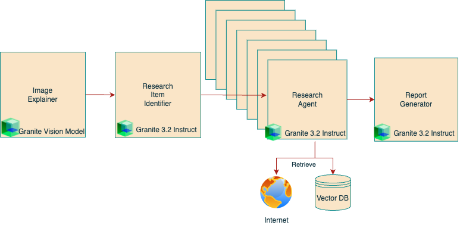

# Granite Retrieval and Image Research Agents

## 🚀 New Feature as of 2/26/25

We’ve added a new example alongside the **Granite Retrieval Agent**: an **Image Research Agent**. This agent leverages the **Granite 3.2 language model** and **Granite 3.2 vision** to analyze images. It breaks down an image into components and dispatches parallel, asynchronous agents for detailed research. This implementation uses the **CrewAI framework**, demonstrating a unique approach to agentic workflows.

---

# 📚 Agents Overview

| Feature                | Description                                           | Models Used                            | Code Link                                                                            | Tutorial Link                                                                                   |
|------------------------|-------------------------------------------------------|----------------------------------------|---------------------------------------------------------------------------------------|---------------------------------------------------------------------------------------------------|
| Granite Retrieval Agent| General Agentic RAG for document and web retrieval using Autogen/AG2 | Granite 3.2 Language, Granite 3.2 Vision | [granite_autogen_rag.py](./granite_autogen_rag.py)                                     | [Build a multi-agent RAG system with Granite locally](https://developer.ibm.com/tutorials/awb-build-agentic-rag-system-granite/)        |
| Image Research Agent   | Image-based multi-agent research using CrewAI with Granite 3.2 Vision | Granite 3.2 Language, Granite 3.2 Vision | [image_researcher_granite_crewai.py](./image_researcher_granite_crewai.py)             | [Build an AI research agent for image analysis with Granite 3.2 Reasoning and Vision models](https://developer.ibm.com/tutorials/awb-build-ai-research-agent-image-analysis-granite/) |

---

## **Granite Retrieval Agent**

The **Granite Retrieval Agent** is an **Agentic RAG (Retrieval Augmented Generation) system** designed for querying both local documents and web retrieval sources. It uses multi-agent task planning, adaptive execution, and tool calling via an open-source LLM such as **Granite 3.2**.

### 🔹 Key Features:

- General agentic RAG for document and web retrieval using **Autogen/AG2**.
- Uses **Granite 3.2 Language & Vision models**.
- Integrates with [Open WebUI Functions](https://docs.openwebui.com/features/plugin/functions/) for interaction via a chat UI.
- **Optimized for local execution** (e.g., tested on MacBook Pro M3 Max with 64GB RAM).

### **Retrieval Agent in Action:**


### **Architecture:**


## **Image Research Agent**

The **Image Research Agent** is designed to analyze images using **Granite 3.2 Vision** and perform multi-agent research on image components. It utilizes the **CrewAI framework** to orchestrate parallel, asynchronous research agents.

### 🔹 Key Features:

- **Image-based multi-agent research** using CrewAI.
- **Granite 3.2 Vision & Language models** power deep image analysis.
- Identifies objects, retrieves related research articles, and provides historical backgrounds.
- Demonstrates a **different agentic workflow** from the Retrieval Agent.

### **Image Researcher in Action:**


### **Architecture:**



---


# 🔑 Key Highlights

- **Common Installation Instructions**: The setup for **Ollama** and **Open WebUI** remains the same for both agents.
- **Flexible Web Search**: Agents now use the Open WebUI search API, integrating with **SearXNG** or other search engines. [Configuration guide](https://docs.openwebui.com/category/-web-search).

---

# 🛠 Getting Started

## **1. Install Ollama**

Refer to [Ollama's README](https://github.com/ollama/ollama) for full installation instructions.

On macOS:

```bash
brew install ollama
```

On Linux:

```bash
curl -fsSL https://ollama.com/install.sh | sh
```

To run Ollama

```bash
ollama serve 
```

Pull the Granite Models
Both agent use Granite Vision:
```bash
ollama pull granite3.2-vision:2b
```

The q8_0 quantization works superior for the Image Researcher
```bash
ollama pull granite3.2:8b-instruct-q8_0
```

For the Granite Retrieval Agent, you may use the default quantization, q4_K_M
```bash
ollama pull granite3.2:8b
```

## **2. Install Open WebUI**

```bash
pip install open-webui
open-webui serve
```

## **3. Optional: Set Up SearXNG for Web Search**

Although **SearXNG is optional**, the agents can integrate it via Open WebUI’s search API.

To set up SearXNG locally:

```bash
docker run -d --name searxng -p 8888:8080 -v ./searxng:/etc/searxng --restart always searxng/searxng:latest
```

Configuration details: [Open WebUI documentation](https://docs.openwebui.com/category/-web-search).

## **4. Import the Agent Python Script into Open WebUI**

1. Open `http://localhost:8080/` and log into Open WebUI.
2. Navigate to the `Admin panel` (lower-left menu).
3. In the `Functions` tab, click `+` to add a new function.
4. Name it **(e.g., "Granite RAG Agent" or "Image Research Agent").**
5. Paste the relevant Python script:
   - `granite_autogen_rag.py` (Retrieval Agent)
   - `image_researcher_granite_crewai.py` (Image Research Agent)
6. Save and enable the function.
7. Adjust settings (inference endpoint, search API, model ID) via the gear icon.

⚠️ If you are receiving open telemetry related errors while importing the `image_researcher_granite_crewai.py` script, see [this issue](https://github.com/ibm-granite-community/granite-retrieval-agent/issues/25).


## **5. Load Documents into Open WebUI**

1. In Open WebUI, navigate to `Workspace` > `Knowledge`.
2. Click `+` to create a new collection.
3. Upload documents for the **Granite Retrieval Agent** to query.

## **6. Configure Web Search in Open WebUI**

To set up a search provider (e.g., SearXNG), follow [this guide](https://docs.openwebui.com/tutorials/web-search/searxng#4-gui-configuration).

# ⚙️ Configuration Parameters

## **Granite Retrieval Agent**

| Parameter         | Description                                    | Default Value          |
|------------------|------------------------------------------------|------------------------|
| task_model_id    | Primary model for task execution              | `granite3.2:8b`        |
| vision_model_id  | Vision model for image analysis               | `granite-vision3.2:2b` |
| openai_api_url   | API endpoint for OpenAI-style model calls     | `http://localhost:11434` |
| openai_api_key   | API key for authentication                    | `ollama`               |
| vision_api_url   | Endpoint for vision-related tasks             | `http://localhost:11434` |
| model_temperature | Controls response randomness                  | `0`                    |
| max_plan_steps   | Maximum steps in agent planning               | `6`                    |

## **Image Research Agent**

| Parameter                | Description                                      | Default Value                            |
|--------------------------|--------------------------------------------------|------------------------------------------|
| task_model_id           | Primary model for task execution                 | `ollama/granite3.2:8b-instruct-q8_0`     |
| vision_model_id         | Vision model for image analysis                  | `ollama/granite-vision3.2:2b`           |
| openai_api_url          | API endpoint for OpenAI-style model calls        | `http://localhost:11434`                 |
| openai_api_key          | API key for authentication                       | `ollama`                                  |
| vision_api_url          | Endpoint for vision-related tasks                | `http://localhost:11434`                 |
| model_temperature       | Controls response randomness                      | `0`                                      |
| max_research_categories | Number of categories to research                 | `4`                                      |
| max_research_iterations | Iterations for refining research results         | `6`                                      |
| include_knowledge_search| Option to include knowledge base search          | `False`                                  |
| run_parallel_tasks      | Run tasks concurrently (Enabling can overwhelm inferencing provider when running locally)                           | `False`                                  |

> **Note:** These parameters can be configured via the gear icon in the **"Functions"** section of the Open WebUI **Admin Panel** after adding the function.

---

# 🚀 Usage

## **Image Research Agent**

- Upload an image to initiate research.
- You can **prompt it with specific details** to refine focus.

### **Example Queries:**

```text
Analyze this image and find related research articles about the devices shown.
```

```text
Break down the image into components and provide a historical background for each object.
```

## **Granite Retrieval Agent (AG2-based RAG)**

- Queries **local documents** and **web sources**.
- Performs **multi-agent task planning** and **adaptive execution**.

### **Example Queries:**

```text
What companies are prominent adopters of the open-source technologies my team is working on?
```

```text
Study my meeting notes to figure out the capabilities of the projects I’m involved in. Then, find me other open-source projects with similar features.
```

---

# ⚠️ Important Notes

- **Open WebUI 0.5 (Released 12/25/24) introduced performance improvements.**
- Some users report occasional issues where chat results **don’t appear until refreshing the browser**.


