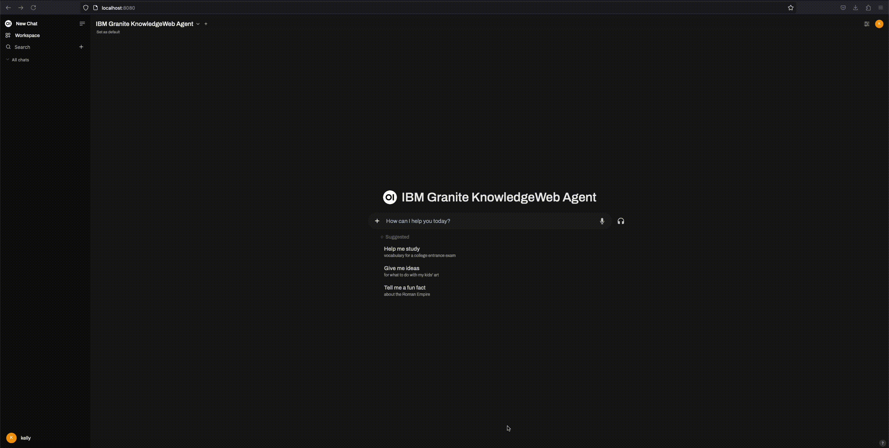
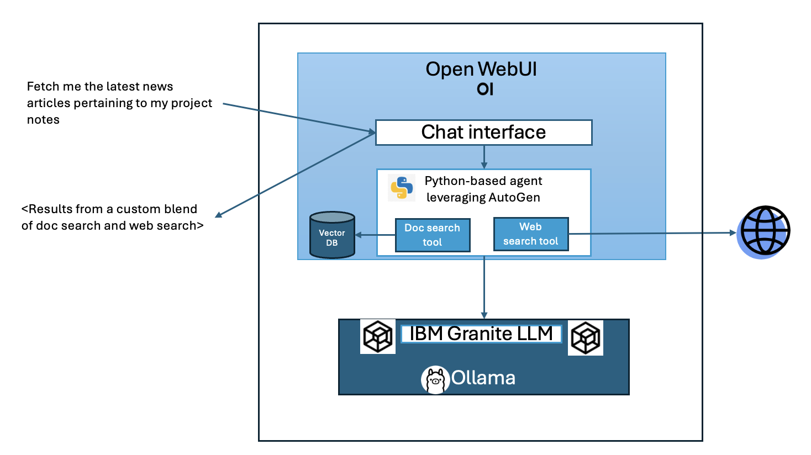
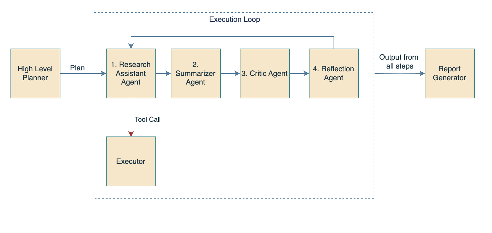
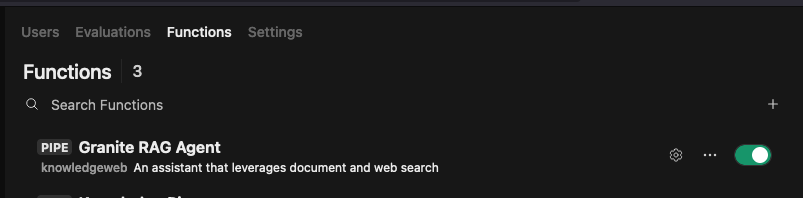

# Granite Retreival Agent

The Granite Retrieval Agent is an implementation of Agentic RAG (Retrieval Augmented Generation) that can answer queries using a combination of both local document and web retrieval. It serves as a both personal productivity tool as well as an example of building an agent using task planning, adaptive step-by-step execution, and tool calling with an open source LLM such as Granite 3.1 at the helm.

For ease of use, this agent is designed to be run locally on your laptop, given sufficient processing and memory - But can be run anywhere. (Initial tests were done using a MacBook Pro with an M3 Max Chip and 64GB of RAM).

The core agent code is wrapped inside of an [Open WebUI Function](https://docs.openwebui.com/features/plugin/functions/) so that interaciton with the agent can be accomplished through an easy to use chat UI.



## Components

1. Open WebUI
2. Ollama
3. Searxng
4. The Python script of this repo - implementing Agentic Workflow, using the AutoGen framework (now known as AG2)


## High Level Architecture


## Agent Architecture


## In-Depth Tour of the Agentic Workflow Architecture
The following article describes the advantages of this multi-agent approach, as well as the architecture of the various agents and their interactions:

* [Build an agentic RAG system with Granite 3.1 on your laptop](https://developer.ibm.com/tutorials/awb-build-agentic-rag-system-granite/)

## Getting Started
### 1. Install Ollama
See [Ollama's README](https://github.com/ollama/ollama) for full installation instructions. However it is as simple as:

On OSX:

```
brew install ollama
```

On Linux:

```
curl -fsSL https://ollama.com/install.sh | sh
```

To run:

```
ollama serve
ollama pull granite3.1-dense:8b
```
Now you are up and running with Ollama and Granite

### 2. Install Open WebUI

```
pip install open-webui
open-webui serve
```

### 3. Setup SearXNG for web search
SearXNG is a metasearch engine that aggregates results from multiple search engines. The reason for it's inclusion in this architecture is that it requires no SaaS API key, as it can run directly on your laptop.

Run the SearXNG docker image:
```
docker run -d --name searxng -p 8888:8080 -v ./searxng:/etc/searxng --restart always searxng/searxng:latest
```
Note: SearXNG and Open WebUI both run on port 8080, so I've mapped SearXNG to my local machine port 8888.
The reference to the `./searxng` folder in the docker run command is a reference to a location on your local machine where you will need to provide some configuration files for Searxng. We recommend you use the exact configuration files provided in the [Open WebUI documentation](https://docs.openwebui.com/features/web_search/).

This agent uses the SearXNG API directory - So you do not need to follow the steps in the Open WebUI documentation to setup SearXNG in the UI of Open WebUI. It is only necessary if you want to use SearXNG via the Open WebUI interface apart from this agent.

### 4. Import the agent python into Open WebUI
1. In your browser, go to `http://localhost:8080/` to access Open Web UI
2. If it is your first time opening the Open WebUI interface, register a user and password. (This information is kept entirely local to your machine, it does not send you emails)
3. After logging in, click on the icon on the lower left hand side where your user name is. This will bring a pop-up menu.
4. Click on `Admin panel`.
5. At the top of the menu, click on Functions
6. At the top right, click the `+` sign to add a new function.
7. Give the function a name and a description such as "Granite RAG Agent"
8. Paste the contents of `granite_autogen_rag.py` into the text box provided, replacing any existing content.
9. Click `Save` at the bottom of the screen.
10. Back on the Functions page, make sure the agent is toggled to "Enabled", as the image below
11. Click on the gear icon next to the enablement toggle to customize any settings such as the inference endpoint, the SearXNG endpoint or the model ID



### 5. Load your documents into Open WebUI
1. In Open WebUI, click on `Workspace` in the upper left hand corner
2. Click `Knowledge` at the top of the screen
3. Click the `+` sign to add a new collection.
4. From here, you may add one or many collections and upload any text documents that you like. These documents will be queried when you instruct the model on a task that refers to extracting knowledge from your documents.

## Usage

Some example queries:
```
What companies are prominent adopters of the open source technologies my teams are working on?
```

```
Study my meeting notes to figure out the capabilities of the projects I’m involved in. Then, find me other open source projects that have similar feature sets.
```